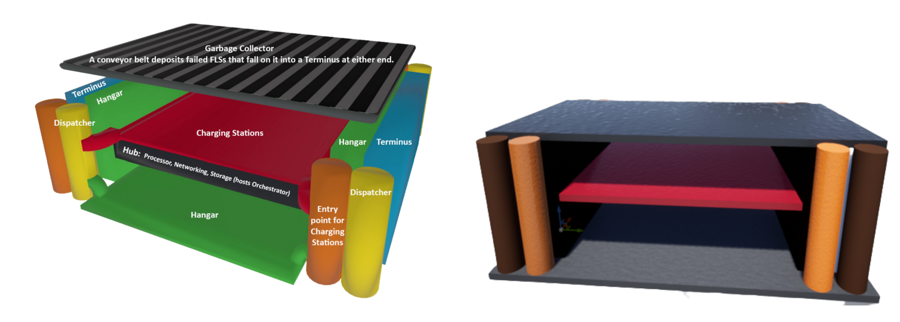
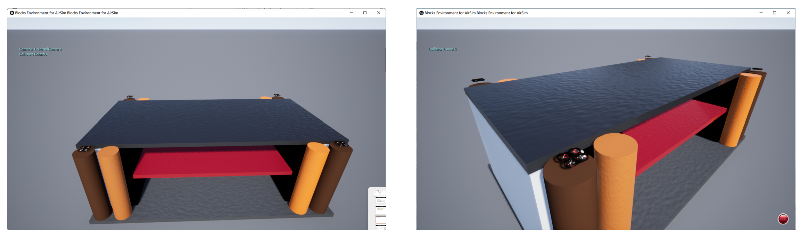
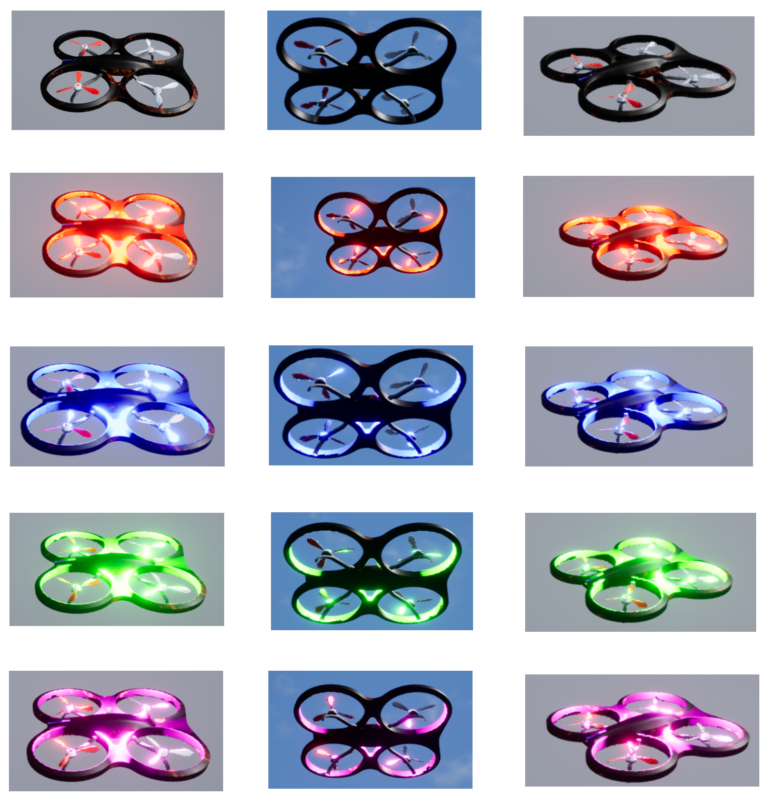
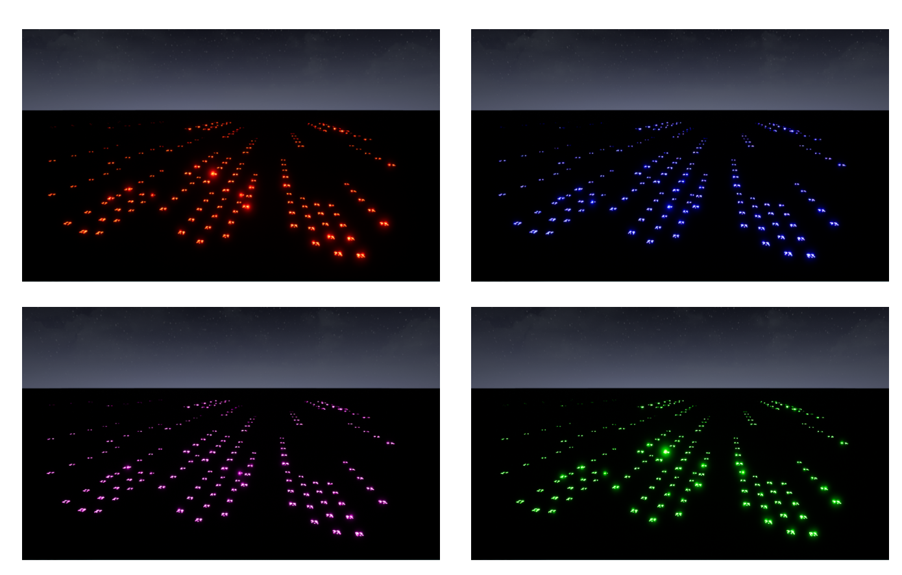

# Towards Simulating Drone 3D Rendering in the Real World
## Authors: Bonan Shen, Gehan Yang
## Advised by professor Shahram Ghandeharizadeh
## Objective
The emerging drone 3D rendering systems is a key enabling technology for future large scale holodeck applications, which often require thousands of Flying Light Specks(FLSs) collaboratively render a 3D illumination. Existing research has demonstrated the theory and possibilities on how to display a 3D illumination using FLSs, algorithms are proposed to optimize the total distance traveled when those drones fly from the dispatcher to destinations. However, drones may not behave identically as it depends on a lot of uncontrolled factors, for example, the size and power of a drone may be different, the sudden wind, or the safety considerations. It can be seen that there is a large gap between algorithms designed in the lab using very simple analytical or simulation methods and the performance of these drones in the real world. In this project, we build a system towards rendering 3D illuminations using a swarm of drones by leveraging path planning, collision avoidance, failure handling and battery charging methods. 
## The Assets We Build
### The architecture proposed in the [paper](https://arxiv.org/pdf/2207.08346.pdf) and the Unreal implementation of our project.

### Drone with Lights Equipped

Currently we provide four colors: Red, Green, Blue and Purple. APIs can be found in `unreal/Change AirSim Api/README.md`. Unreal Assets can be found in `unreal` folder.

### Rendering USC logo using these assets

This project mainly follows paper [Display of 3D Illuminations using Flying Light Specks](https://arxiv.org/pdf/2207.08346.pdf)

# How to run the demo
* Open `unreal/README.md` and `unreal/Change AirSim Api/README.md`, follow the steps.
* Open `flags.py`, change `Flag_ue_executable_settings_path` to your local AirSim settings path.
* Execute `python control.py`. You will see a sentence `Press any key to continue...`. At this time, open your `blocks.exe` and press any key in the terminal. The controller will automatically start.